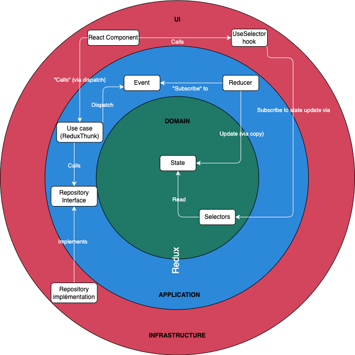
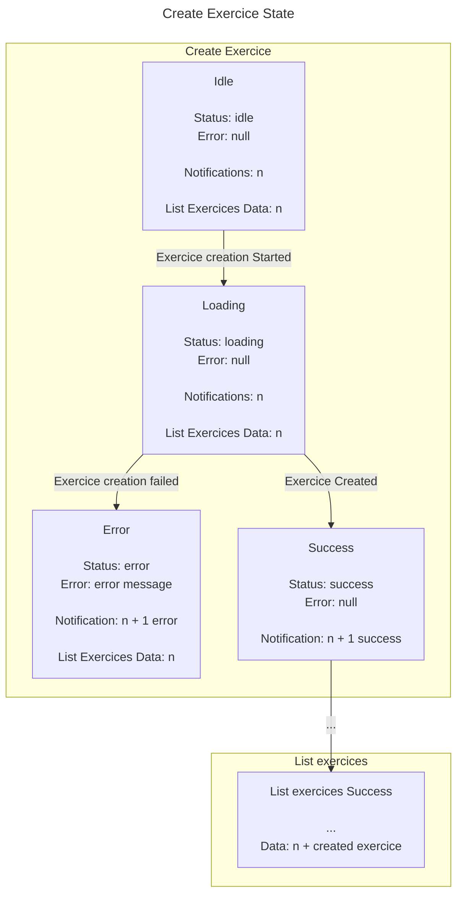
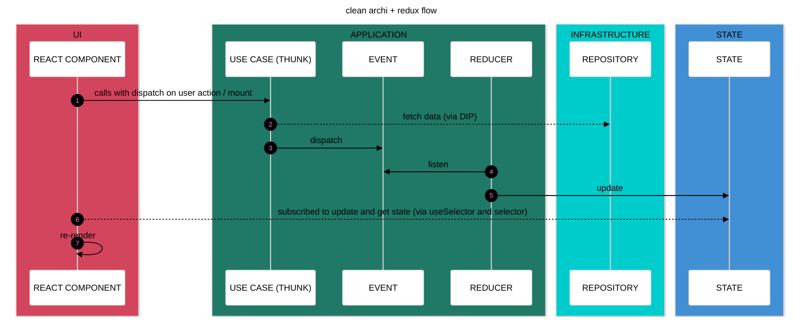

# Clean archi Redux / React App

## A demo application built with React and Redux, showcasing an event-driven architecture implemented using Clean Architecture and vertical slices principles.

- This project is exploratory and aims to experiment with different ways to structure a front end application and use TDD / tests.
- Feel free to contribute or provide feedback if you have any ideas, suggestions, or believe something can be improved.
- The React components and React Native pages are not the main focus of this project and have been kept simple. So you may still encounter some TODO items or TypeScript warnings in the UI layer. There is not test for react component.

 

### My grief with react and "classic" react state management: 

- Feeling like I'm hacking things together to manage my components' state
- Struggling to decouple enough from the UI
- Creating/moving hooks and "services" here and there
- Overuse of hooks that create a big mess
- Failing to do TDD or test properly (too much coupling, too fragile, little logic to test...) and struggling to give value to those tests
- Using X or Y state management libraries/APIs
- Trying to implement principles that don't fit well with React’s flow, ending up with overengineered solutions
- Having to reload the page to see state changes and replay scenarios
- Needing a backend to test scenarios and polluting the database with every manual test

 

### Clean architecture in frontend: 

Clean architecture is often associated with back-end development. Using it on the front end is sometimes seen as overkill. However, at its core, Clean Architecture is simple and allows the code to be more testable and maintainable.

The main idea is to separate the React component from the business logic and the data access, ensuring that the business logic is easily testable (via unit tests).

Imagine this user story: “As a user, I want to create an exercise.” The business logic is to create an exercise. The data access involves fetching exercises. The React component is responsible for displaying exercises and allowing the user to create a new exercise.

So we can already separate the code into three parts:

- The React component (UI)
- The business logic (use case)
- The data access (repository)

We can create a class or function called CreateExerciseUseCase that validates the data sent by the user and creates the exercise by calling the repository.
The repository contains the fetch function to actually create the exercise in the backend.

In practice, the UI calls the use case, and the use case calls the repository. Because the use case is coupled to the repository, it cannot be easily tested without sending a request to the backend.

To solve this, we can apply the Dependency Inversion Principle (DIP) and inject the repository into the use case via an interface. This way, we can mock the repository: either for developping the frontend without having a backend yet (useful for rapid Proof of Value), or in tests, allowing us to test the use case without actually making real requests.

Annnnd that’s it. We have a Clean Architecture approach in the frontend. 

But as the state was managed by React, it's still difficult to test the state changes and the transitions between states.
That's when Redux comes in.

 

### What about Redux?

So to store data in our application (e.g., the logged-in user, a list of exercises, etc.), we need state. To share this state between components, we can use the Context API or a state management library such as Zustand, Recoil, or Redux. Redux has a reputation for having a lot of boilerplate and is sometimes considered overkill.

Why choose Redux?
Because Redux is not just a state manager. In this app, we use Redux for four main purposes:

1) State Management : To store the global application state.
2) (Kind of) Pub/Sub System : We dispatch actions from our use cases, and reducers listen for these actions to update the state accordingly. 
3) Dependency Injection: By using the extraArgument option, we can inject the repository (for data fetching, etc.) into the use case
4) Middleware for Side Effects : Redux Thunk (or another middleware) handles side effects, such as API calls, from within the use case.

I feel like Redux perfectly fills the missing holes with Clean Architecture with React. 
The event driven architecture which is enabled by Redux allows us to manage the state in a predictable way. And to think about state and transition without React in mind. That way, we can focus on the business logic and the state transitions, and test them without needing to open the browser. We can also modelize the state transitions with a state machine diagram, which is a great way to visualize the application flow, and using TDD to develop the use cases and state changes.
When done, we just need to plug in the React component. React is used only for what it was designed for: the UI

(_image from Yazan Alaboudi Redux talk: https://slides.com/yazanalaboudi/deck#/46_)

 

### My Dev methodology using TDD:
- Definition of the scenario for the feature. Example:
  - As a user, I want to create an exercise
  - Given no exercise is already created
  - When the exercise creation starts
  - Then the loading should be true
- Creation of a state machine diagram to visualize state transitions
- Writing the first acceptance test based on the scenario (red)
- Implementation of the use case using baby step (green)
- Refactoring the code (refactor)
- The unit tests are socials with the use case as the starting point and assert against the current state

#### State machine diagram exemple (use case create exercice):

 

### ~~DDD~~:
- No tactical DDD patterns
- No true domain model
- Business rules and invariant guarantees are handled by the backend (single source of truth)
- For validations: simple validation services called within use cases

 

### About vertical slices:

- Each feature contains:
  - The anemic state shape and the initial state (domain model)
  - The selector (to read the state from the store, like "getters")
  - The reducers (to listens to events and to update the state)
  - The use case (to call the repository and dispatch events)
  - The Use case tests
  - The State transition diagram (state machine diagram)
  - Events (Redux actions created with createAction)
  - A service validator, if necessary (invariant is mostly handled by the backend)

- Shared between features:
  - The repository: implementation + interface (overkill to create a repository + repository interface per use case, manage its injection, etc.)
  - The domain model type
  - A reducer that combines each feature's reducers
    - Using combineReducer if each reducer operates on a separate portion of the state
    - OR using a custom utility composeReducers to merge reducers without creating a new state key if reducers operate on the same state portion (e.g., creating/deleting notifications)

 

### Please note: 

- Redux is integrated within the hexagonal architecture (application / domain). It is overkill to decouple from it, as it's in the heart of the domain and the application layer.
- The synchrone Redux action are named "event"
- The layers are not defined with traditional folders like application, domain, infrastructure, etc., but Clean Architecture principles are still respected (dependencies are directed inward, etc.). A vertical slices approach is used instead to gather all the code related to a feature in one place.
- The Use cases are managed directly within Redux thunks for more granular control over Redux event (action) dispatching.
-  If other events related to another feature need to be dispatched after an event (e.g., creating an exercise triggers a new fetch of exercises), they are dispatched within the same use case.
  - A use case does not call another use case
  - React components does not manage the application flow, so it's not his responsibility call a use case after one is done
- The state is not normalized (using Normalizer for exemple) and the ui state is not separated from the "entity" state in the store (but it can be if the relational / nested data become is too complex)
- The selectors here are not created using createSelector (Reselect) because the data retrieved from the store is not derived or transformed

 

### Execution flow:

 

### Execution flow exemple (use case create exercice): 

 

Useful ressources: 

- [Codeminer42 Blog "Scalable Frontend series"](https://blog.codeminer42.com/scalable-frontend-1-architecture-9b80a16b8ec7/)
- [Michel Weststrate's "UI as an afterthought" article](https://michel.codes/blogs/ui-as-an-afterthought)
- [Dan Abramov's "Hot Reloading with Time Travel" talk](https://www.youtube.com/watch?v=xsSnOQynTHs)
- [Dan Abramov's "The Redux Journey " talk](https://www.youtube.com/watch?v=uvAXVMwHJXU)
- [Michaël Azerhad's Linkedin posts about Redux](https://www.linkedin.com/in/michael-azerhad/)
- [Lee Byron's "Immutable Application Architecture" talk](https://www.youtube.com/watch?v=oTcDmnAXZ4E)
- [Nir Kaufman's "Advanced Redux Patterns" talk](https://www.youtube.com/watch?v=JUuic7mEs-s)
- [Robin Wieruch's book "Taming state in react"](https://github.com/taming-the-state-in-react/taming-the-state-in-react?tab=readme-ov-file)
- [Facebook Flux presentation](https://www.youtube.com/watch?v=nYkdrAPrdcw&list=PLb0IAmt7-GS188xDYE-u1ShQmFFGbrk0v)
- [Yazan Alaboudi's "Our Redux Anti Pattern" talk](https://slides.com/yazanalaboudi/deck#/46)
- [Robert C. Martin's "Clean Architecture" book](https://blog.cleancoder.com/uncle-bob/2012/08/13/the-clean-architecture.html)
- [David Khourshid's "Robust React User Interfaces with Finite State Machines" article](http://css-tricks.com/robust-react-user-interfaces-with-finite-state-machines/)
- [David Khourshid's "Infinitely Better UIs with Finite Automata" talk](https://www.youtube.com/watch?v=VU1NKX6Qkxc)