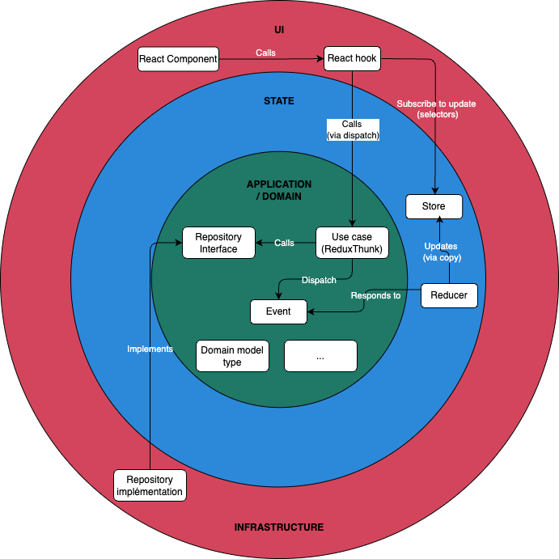
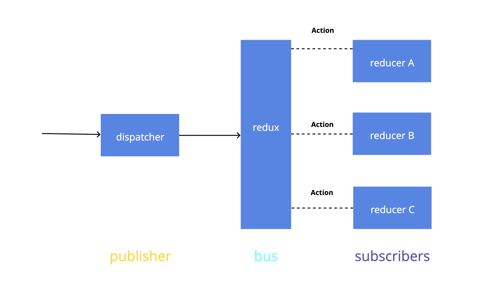
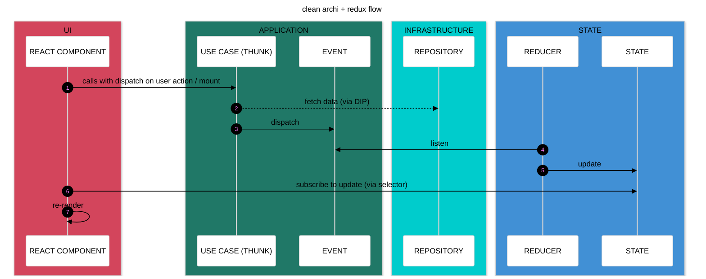
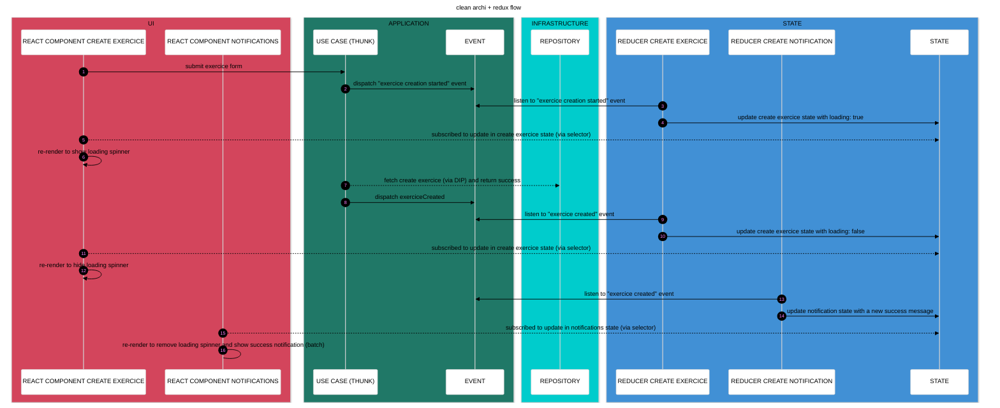
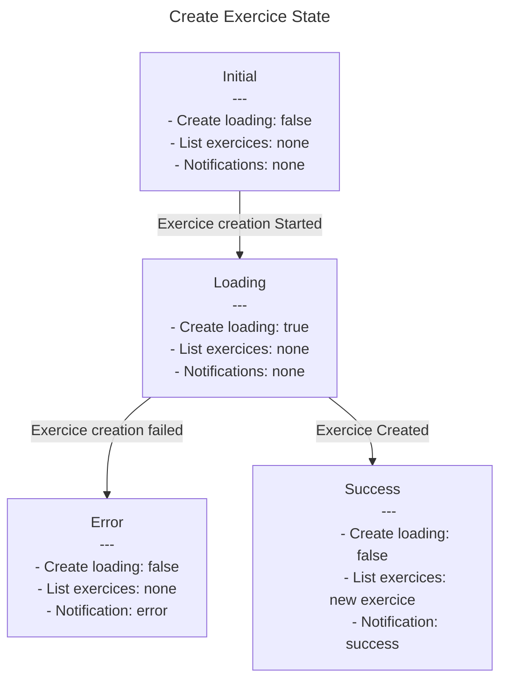

# Clean archi Redux / React App

## A demo application built with React and Redux, showcasing an event-driven architecture implemented using Clean Architecture and vertical slices principles.

### Notes: 
- This project is exploratory and aims to experiment with different ways to structure a front end application and use TDD / tests.
- Feel free to contribute or provide feedback if you have any ideas, suggestions, or believe something can be improved.
- The React components and React Native pages are not the main focus of this project and have been kept simple. So you may still encounter some TODO items or TypeScript warnings in the UI layer.

### Issues in react with "classic" react state management, without clean architecture and redux:
- Feeling like I'm hacking things together to manage my components' state
- Struggling to decouple enough from the UI
- Creating/moving hooks and "services" here and there
- Failing to do TDD or test properly (too much coupling, too fragile, little logic to test...) and struggling to give value to those tests
- Using X or Y state management libraries/APIs
- Trying to implement principles that don't fit well with React’s flow, ending up with overengineered solutions
- Having to reload the page to see state changes and replay scenarios
- Needing a backend to test scenarios and polluting the database with every manual test

### Avantages of using clean architecture + redux
- Being able to TDD / test my use cases and state changes
- Developing my use cases and state changes without needing to open my browser or worry about React
- Using React only for what it was designed for: the UI
- Unlock event-driven architecture that allow finite state machine modeling
  - Which allow making state and transition predictable
  - Wich allow the static analyze and optimization of state transition
- Being able to develop the frontend without (yet) having a backend, to get quick product feedback and pivot if needed

### Clean Architecture:
- The layers are not defined with folders like application, domain, infrastructure, etc., but Clean Architecture principles are still respected (dependencies are directed inward, etc.).
- Dependency injection is handled using the store's extra arguments.
- Use cases are managed directly within Redux thunks for more granular control over Redux event (action) dispatching.
- Redux is integrated within the hexagonal architecture (application and state layers).

### Vertical slices:
- Separation by features
- Each feature contains:
  - The use case
  - Use case tests
  - State transition diagram (state machine diagram)
  - Events (Redux actions created with createAction)
  - The command, if the use case is a command handler
  - A service validor, if necessary (invariant is mostly handled by the backend)
- Shared between features:
  - The repository: implementation + interface (overkill to create a repository + repository interface per use case, manage its injection, etc.)
  - The domain model type
  - A reducer that combines each feature's reducers
    - Using combineReducer if each reducer operates on a separate portion of the state
    - OR using a custom utility composeReducers to merge reducers without creating a new state key if reducers operate on the same state portion (e.g., creating/deleting notifications)
- The UI folder is separated from features to reinforce decoupling and make it easier to reason about the hexagone independently.

### Redux / Event Driven Architecture:
- Redux is viewed here as a synchronous “message bus” using a pub-sub pattern (in a loose sense). Each use case dispatch actions (similar to message / event), and reducers somehow subscribe to them.
- Allows visualizing application state transitions (state machine diagram)
- The use case is asynchronous and handles side effects (API calls, etc.)
- If other events related to another feature need to be dispatched after an event (e.g., creating an exercise triggers a new fetch of exercises), they are dispatched within the use case
  - A use case does not call another use case
  - React components does not manage the application flow
- The state is not normalized (using Normalizer for exemple) and the ui state is not separated from the domain state in the store (but it can be if the relational / nested data become is too complex)
- The selectors here are not created using createSelector (Reselect) because the data retrieved from the store is not derived or transformed

(_from Yazan Alaboudi Redux talk: https://slides.com/yazanalaboudi/deck#/46_)
### TDD / dev methodology: 
- Definition of the scenario for the feature. Example:
  - As a user, I want to create an exercise
  - Given no exercise is already created
  - When the exercise creation starts
  - Then the loading should be true
- Creation of a state machine diagram to visualize state transitions
- Writing the first acceptance test based on the scenario (red) 
- Implementation of the use case (green)
- Refactoring the code (refactor)
- The unit tests are socials with the use case as the starting point and assert against the current state

### ~~DDD~~:
- No tactical DDD patterns
- No true domain model
- Business rules and invariant guarantees are handled by the backend (single source of truth)
- For validations: simple validation services called within use cases

### Execution flow:

### Execution flow exemple (use case create exercice): 

### State machine diagram exemple (use case create exercice):

Useful ressources: 

- [Codeminer42 Blog "Scalable Frontend series"](https://blog.codeminer42.com/scalable-frontend-1-architecture-9b80a16b8ec7/)
- [Dan Abramov's "Hot Reloading with Time Travel" talk](https://www.youtube.com/watch?v=xsSnOQynTHs)
- [Dan Abramov's "The Redux Journey " talk](https://www.youtube.com/watch?v=uvAXVMwHJXU)
- [Michaël Azerhad's Linkedin posts about Redux](https://www.linkedin.com/in/michael-azerhad/)
- [Lee Byron's "Immutable Application Architecture" talk](https://www.youtube.com/watch?v=oTcDmnAXZ4E)
- [Nir Kaufman's "Advanced Redux Patterns" talk](https://www.youtube.com/watch?v=JUuic7mEs-s)
- [Robin Wieruch's book "Taming state in react"](https://github.com/taming-the-state-in-react/taming-the-state-in-react?tab=readme-ov-file)
- [Facebook Flux presentation](https://www.youtube.com/watch?v=nYkdrAPrdcw&list=PLb0IAmt7-GS188xDYE-u1ShQmFFGbrk0v)
- [Yazan Alaboudi's "Our Redux Anti Pattern" talk](https://slides.com/yazanalaboudi/deck#/46)
- [Robert C. Martin's "Clean Architecture" book](https://blog.cleancoder.com/uncle-bob/2012/08/13/the-clean-architecture.html)
- [David Khourshid's "Robust React User Interfaces with Finite State Machines" article](http://css-tricks.com/robust-react-user-interfaces-with-finite-state-machines/)
- [David Khourshid's "Infinitely Better UIs with Finite Automata" talk](https://www.youtube.com/watch?v=VU1NKX6Qkxc)