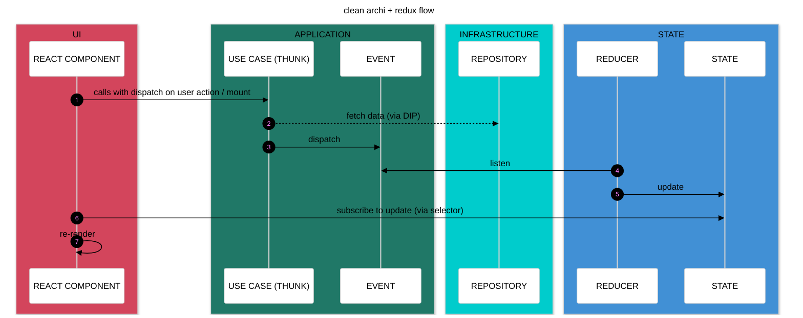
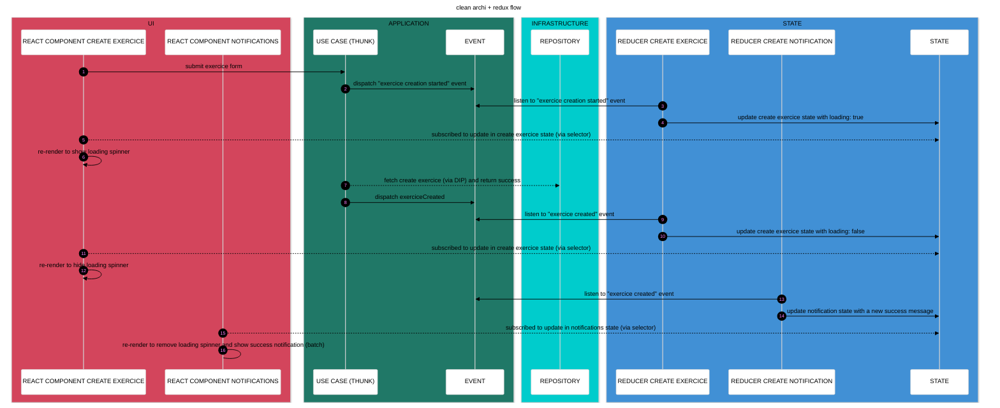
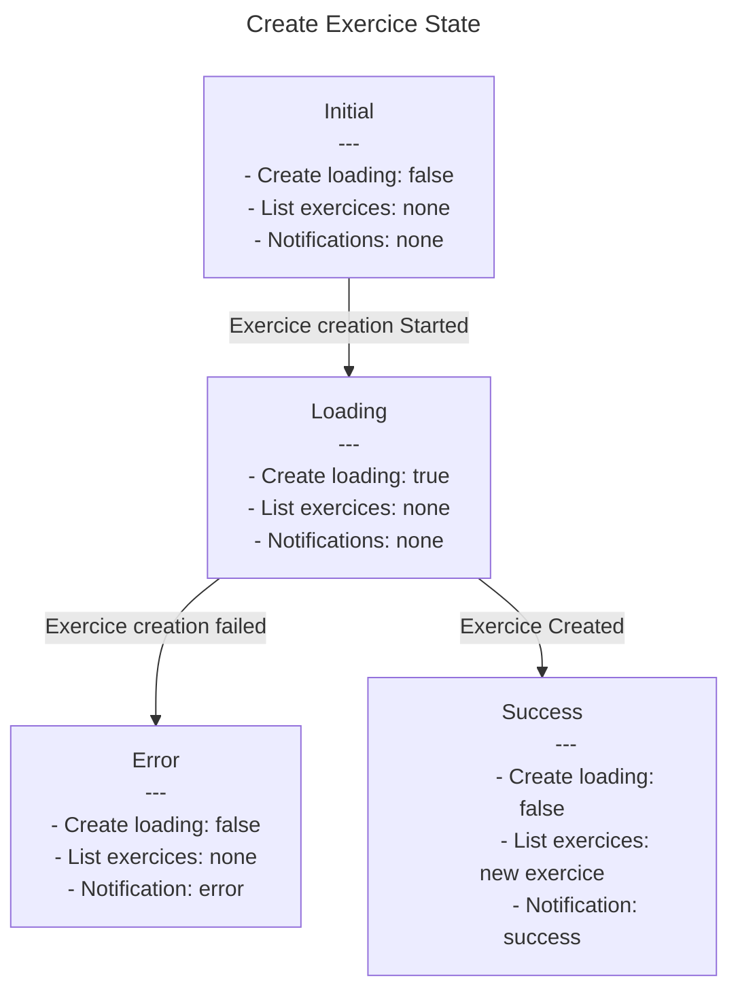

# Clean archi Redux / React App

## A demo application built with React and Redux, showcasing an event-driven architecture implemented using Clean Architecture and vertical slices principles.

### Issues in react with "classic" react state management, without clean architecture:
- Feeling like I'm hacking things together to manage my components' state
- Struggling to decouple myself enough from the UI
- Creating/moving hooks and "services" here and there
- Failing to do TDD or test properly (too much coupling, too fragile, little logic to test...) and struggling to give value to those tests
- Using X or Y state management libraries/APIs
- Trying to implement principles that don't fit well with React’s flow, ending up with overengineered solutions
- Having to reload the page to see state changes and replay scenarios
- Needing a backend to test scenarios and polluting the database with every manual test

### Clean Architecture:
- The layers are not defined with folders like application, domain, infrastructure, etc., but Clean Architecture principles are still respected (dependencies are directed inward, etc.).
- Dependency injection is handled using the store's extra arguments.
- Use cases are managed directly within Redux thunks for more granular control over Redux event (action) dispatching.
- Redux is integrated within the hexagonal architecture (application and state layers).

### Vertical slices:
- Separation by features
- Each feature contains:
  - The use case
  - Use case tests
  - State transition diagram (state machine diagram)
  - Events (Redux actions created with createAction)
  - The command, if the use case is a command
- Shared between features:
  - The repository: implementation + interface (overkill to create a repository + repository interface per use case, manage its injection, etc.)
  - The domain model type
  - A reducer that combines each feature's reducers
    - Using combineReducer if each reducer operates on a separate portion of the state
    - OR using a custom utility composeReducers to merge reducers without creating a new state key if reducers operate on the same state portion (e.g., creating/deleting notifications)
- The UI folder is separated from features to reinforce decoupling and make it easier to reason about the hexagone independently.

### Event Driven Architecture:
- Allows visualizing application state transitions (state machine diagram)
- Each use case (Redux thunk) dispatches Redux actions (called "events" for clarity), which are listened to by reducers
- The use case is asynchronous and handles side effects (API calls, etc.)
- If other events related to another feature need to be dispatched after an event (e.g., creating an exercise triggers a new fetch of exercises), they are dispatched within the use case
  - A use case does not call another use case
  - React components does not manage the application flow
  
### TDD / dev methodology: 
- Definition of the scenario for the feature. Example:
  - As a user, I want to create an exercise
  - Given no exercise is already created
  - When the exercise creation starts
  - Then the loading should be true
- Creation of a state machine diagram to visualize state transitions
- Writing the first acceptance test based on the scenario (red) 
- Implementation of the use case (green)
- Refactoring the code (refactor)
- The unit tests are socials with the use case as the starting point and assert against the current state

### ~~DDD~~:
- No tactical DDD patterns
- No true domain model
- Business rules and invariant guarantees are handled by the backend (single source of truth)
- For validations: simple validation services called within use cases

### Avantages:
- Being able to TDD / test my use cases and state changes
- Developing my use cases and state changes without needing to open my browser or worry about React
- Using React only for what it was designed for: the UI
- Making state predictable
- Being able to develop the frontend without (yet) having a backend, to get quick product feedback and pivot if needed

### Execution flow:

### Execution flow exemple (use case create exercice): 

### State machine diagram exemple (use case create exercice):

