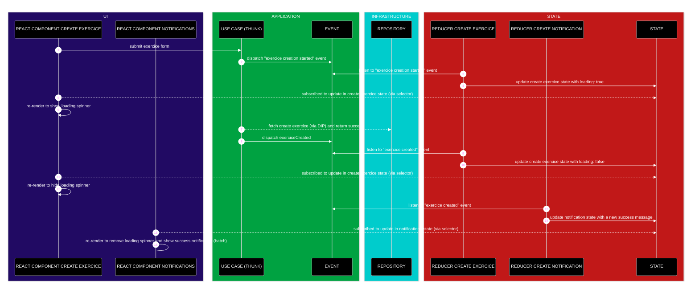

```mermaid
---
title: clean archi + redux flow
---

sequenceDiagram
    autonumber

    box rgb(33,10,99) UI
        participant REACT COMPONENT CREATE EXERCICE
        participant REACT COMPONENT NOTIFICATIONS
    end
    
    box rgb(0,162,65) APPLICATION
        participant USE CASE (THUNK)
        participant EVENT
    end

    box rgb(0,204,204) INFRASTRUCTURE
        participant REPOSITORY
    end

    box rgb(193,24,24) STATE
        participant REDUCER CREATE EXERCICE
        participant REDUCER CREATE NOTIFICATION
        participant STATE
    end


    REACT COMPONENT CREATE EXERCICE->>USE CASE (THUNK): submit exercice form
    USE CASE (THUNK)->>EVENT: dispatch "exercice creation started" event
    
    REDUCER CREATE EXERCICE->>EVENT: listen to "exercice creation started" event
    REDUCER CREATE EXERCICE->>STATE: update create exercice state with loading: true
    REACT COMPONENT CREATE EXERCICE-->>STATE: subscribed to update in create exercice state (via selector)
    REACT COMPONENT CREATE EXERCICE->>REACT COMPONENT CREATE EXERCICE: re-render to show loading spinner

    USE CASE (THUNK)-->>REPOSITORY: fetch create exercice (via DIP) and return success
    USE CASE (THUNK)->>EVENT: dispatch exerciceCreated
    
    REDUCER CREATE EXERCICE->>EVENT: listen to "exercice created" event
    REDUCER CREATE EXERCICE->>STATE: update create exercice state with loading: false
    REACT COMPONENT CREATE EXERCICE-->>STATE: subscribed to update in create exercice state (via selector)
    REACT COMPONENT CREATE EXERCICE->>REACT COMPONENT CREATE EXERCICE: re-render to hide loading spinner

    REDUCER CREATE NOTIFICATION->>EVENT: listen to "exercice created" event
    REDUCER CREATE NOTIFICATION->>STATE: update notification state with a new success message
    REACT COMPONENT NOTIFICATIONS-->>STATE: subscribed to update in notifications state (via selector)
    REACT COMPONENT NOTIFICATIONS->REACT COMPONENT NOTIFICATIONS: re-render to remove loading spinner and show success notification (batch)


%%{
  init: {
    'theme': 'base',
    'themeVariables': {
        'background': '#f6f6f6',
        'primaryColor': 'black',
        'primaryTextColor': 'white',
        'primaryBorderColor': 'lightgrey',
        'lineColor': 'green',
        'secondaryColor': 'green',
        'tertiaryColor': 'green'
    }
  }
}%%
```