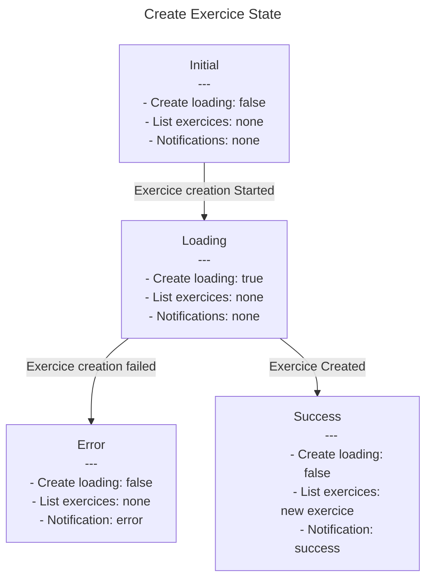

```mermaid
---
title: Create Exercice State
---

flowchart TD
    A[
        Initial
        ---
            - Create loading: false
            - List exercices: none
            - Notifications: none
    ]

    B[
        Loading
        ---
            - Create loading: true
            - List exercices: none
            - Notifications: none
    ]

    C[
        Error
        ---
            - Create loading: false
            - List exercices: none
            - Notification: error
    ]

    D[
        Success
        ---
            - Create loading: false
            - List exercices: new exercice
            - Notification: success
    ]

    A -->|Exercice creation Started|B
    B -->|Exercice creation failed|C
    B -->|Exercice Created|D

```