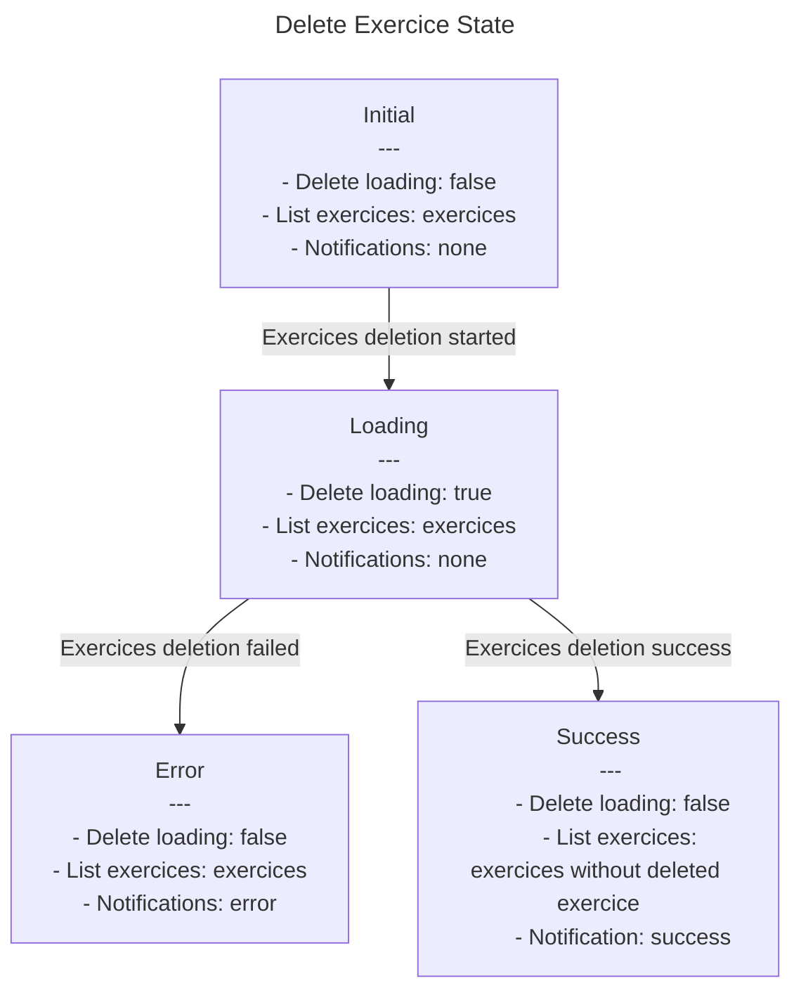

```mermaid
---
title: Delete Exercice State
---
flowchart TD
    
A[
    Initial
    ---
        - Delete loading: false
        - List exercices: exercices
        - Notifications: none
]

B[
    Loading
    ---
        - Delete loading: true
        - List exercices: exercices
        - Notifications: none
]

C[
    Error
    ---
        - Delete loading: false
        - List exercices: exercices
        - Notifications: error
]

D[
    Success
    ---
        - Delete loading: false
        - List exercices: exercices without deleted exercice
        - Notification: success
]

A -->|Exercices deletion started|B
B -->|Exercices deletion failed|C
B -->|Exercices deletion success|D

```
