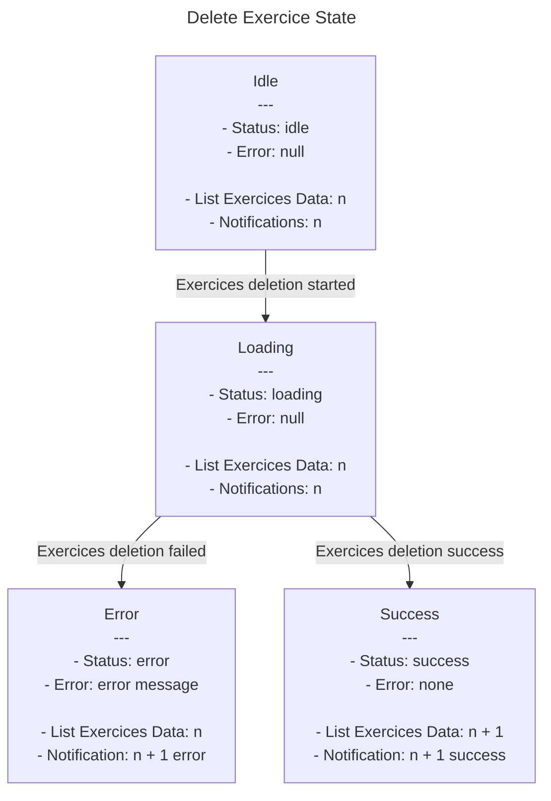

```mermaid
---
title: Delete Exercice State
---
flowchart TD
    
A[
    Idle
    ---
        - Status: idle
        - Error: null

        - List Exercices Data: n
        - Notifications: n
]

B[
    Loading
    ---
        - Status: loading
        - Error: null

        - List Exercices Data: n
        - Notifications: n
]

C[
    Error
    ---
        - Status: error
        - Error: error message
        
        - List Exercices Data: n
        - Notification: n + 1 error
]

D[
    Success
    ---
        - Status: success
        - Error: none
    
        - List Exercices Data: n + 1
        - Notification: n + 1 success
]

A -->|Exercices deletion started|B
B -->|Exercices deletion failed|C
B -->|Exercices deletion success|D

```
