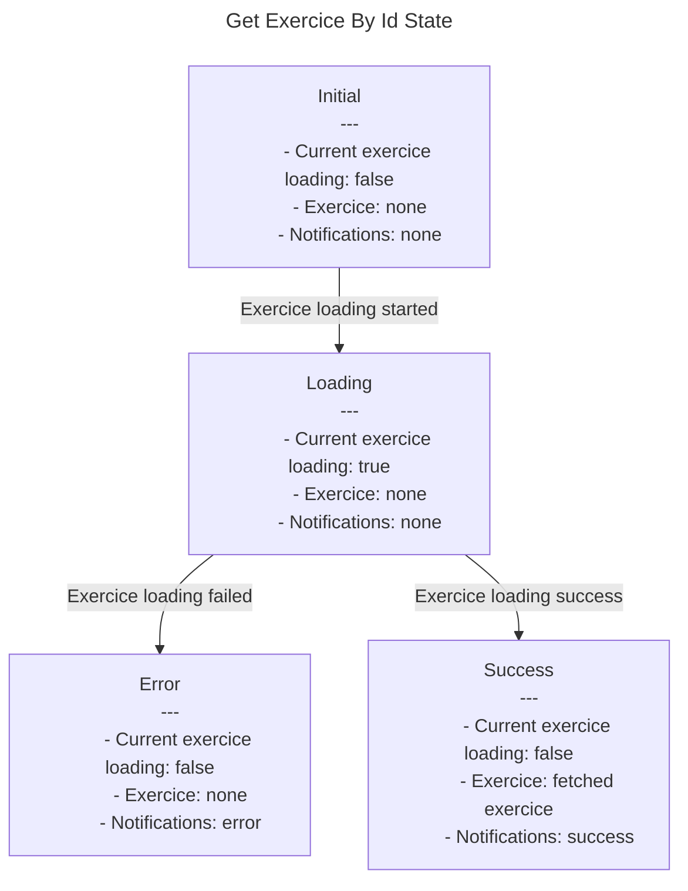

```mermaid
---
title: Get Exercice By Id State
---
flowchart TD

A[
    Initial
    ---
        - Current exercice loading: false
        - Exercice: none
        - Notifications: none
]

B[
    Loading
    ---
        - Current exercice loading: true
        - Exercice: none
        - Notifications: none
]

C[
    Error
    ---
        - Current exercice loading: false
        - Exercice: none
        - Notifications: error
]

D[
    Success
    ---
        - Current exercice loading: false
        - Exercice: fetched exercice
        - Notifications: success
]

A -->|Exercice loading started|B
B -->|Exercice loading failed|C
B -->|Exercice loading success|D
```

