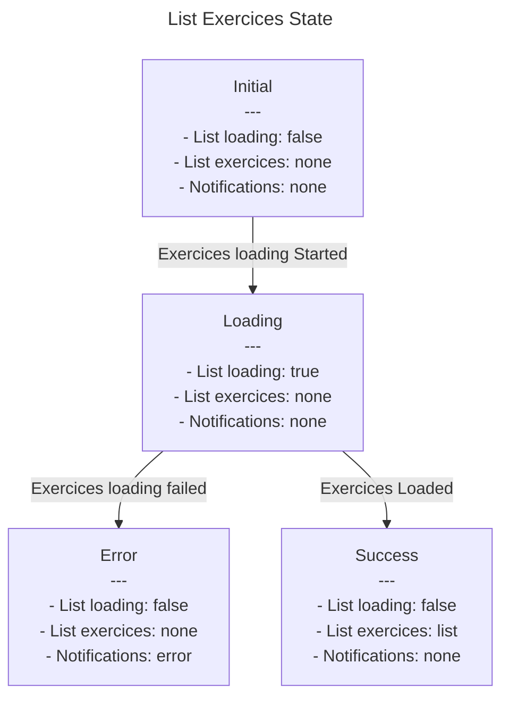

```mermaid
---
title: List Exercices State
---
flowchart TD
    
A[
    Initial
    ---
        - List loading: false
        - List exercices: none
        - Notifications: none
]

B[
    Loading
    ---
        - List loading: true
        - List exercices: none
        - Notifications: none
]

C[
    Error
    ---
        - List loading: false
        - List exercices: none
        - Notifications: error
]

D[
    Success
    ---
        - List loading: false
        - List exercices: list
        - Notifications: none
]

A -->|Exercices loading Started|B
B -->|Exercices loading failed|C
B -->|Exercices Loaded|D

```