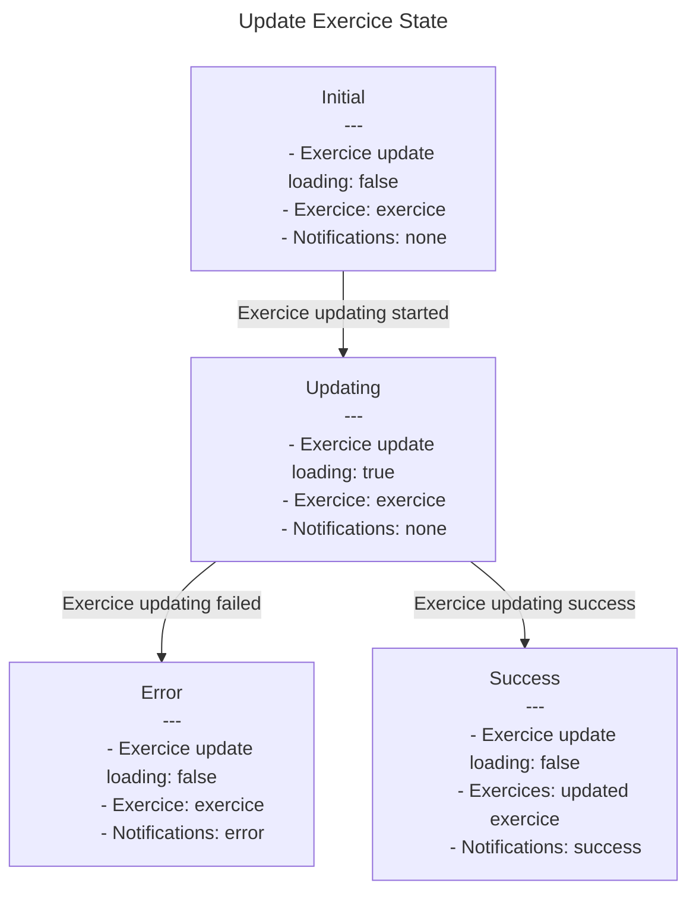

```mermaid
---
title: Update Exercice State
---
flowchart TD

A[
    Initial
    ---
        - Exercice update loading: false
        - Exercice: exercice
        - Notifications: none
]

B[
    Updating
    ---
        - Exercice update loading: true
        - Exercice: exercice
        - Notifications: none
]

C[
    Error
    ---
        - Exercice update loading: false
        - Exercice: exercice
        - Notifications: error
]

D[
    Success
    ---
        - Exercice update loading: false
        - Exercices: updated exercice
        - Notifications: success
]

A -->|Exercice updating started|B
B -->|Exercice updating failed|C
B -->|Exercice updating success|D
```
