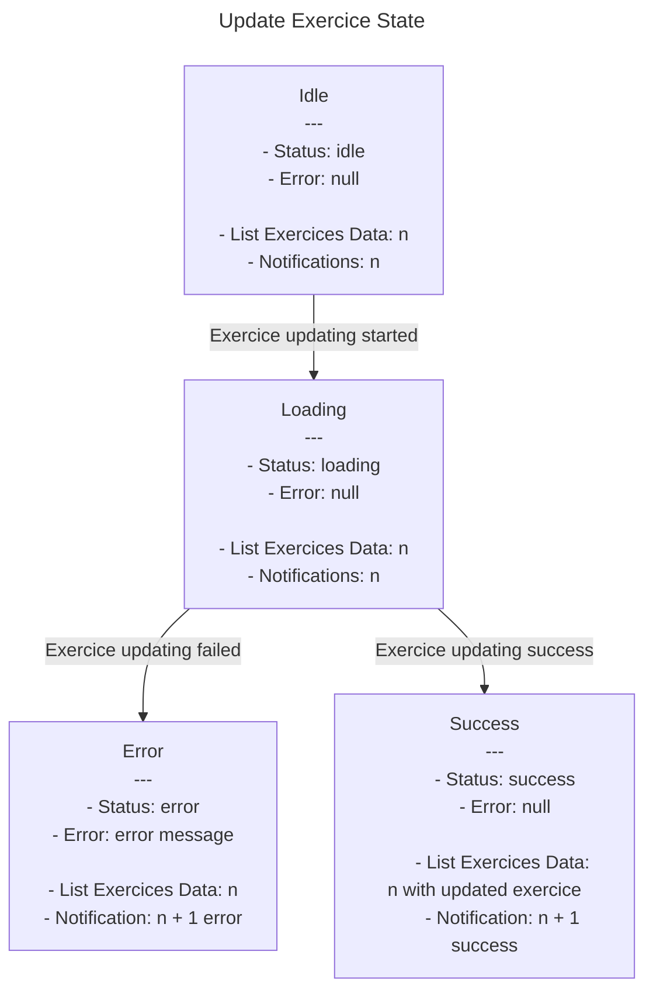

```mermaid
---
title: Update Exercice State
---
flowchart TD

A[
    Idle
    ---
        - Status: idle
        - Error: null
    
        - List Exercices Data: n
        - Notifications: n
]

B[
    Loading
    ---
        - Status: loading
        - Error: null
    
        - List Exercices Data: n
        - Notifications: n
]

C[
    Error
    ---
        - Status: error
        - Error: error message
    
        - List Exercices Data: n
        - Notification: n + 1 error
    ]

D[
    Success
    ---
        - Status: success
        - Error: null
    
        - List Exercices Data: n with updated exercice
        - Notification: n + 1 success
]

A -->|Exercice updating started|B
B -->|Exercice updating failed|C
B -->|Exercice updating success|D
```
